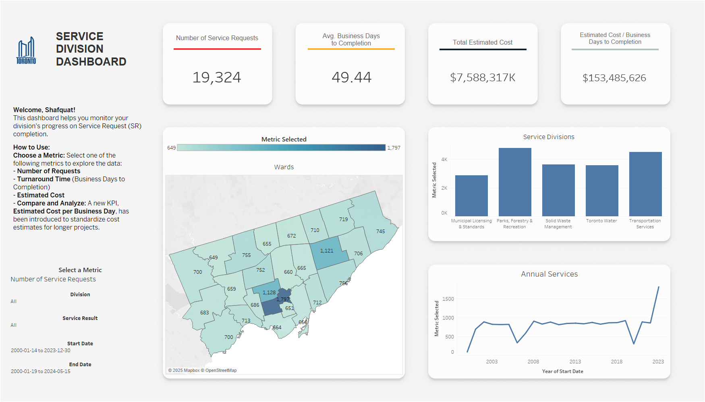
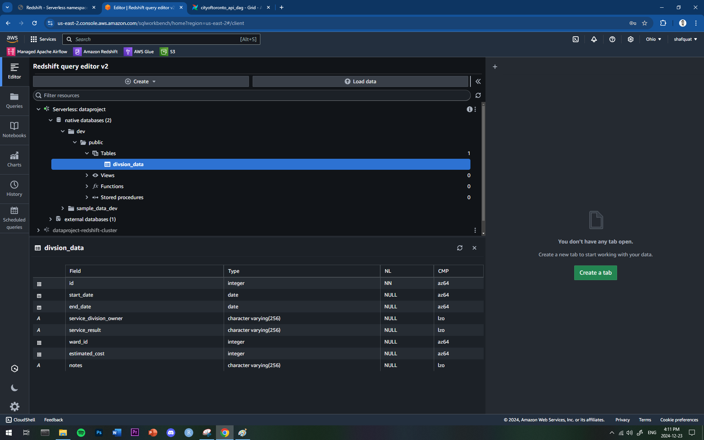
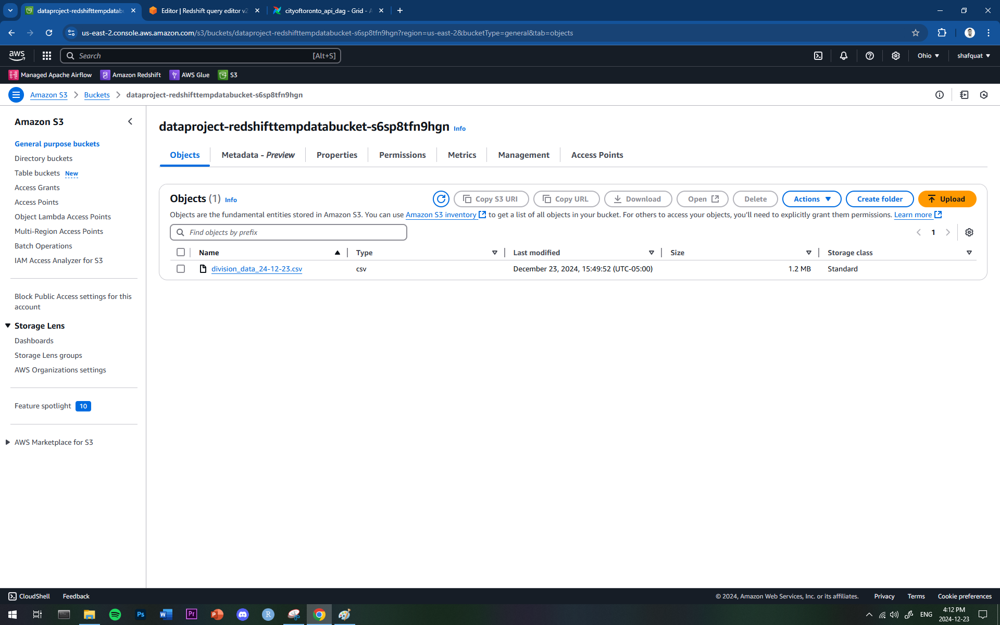

# Take-Home Assignment: Senior Systems Integrator (Data Science and Visualization) (48634)

## [Service Division Dashboard](https://public.tableau.com/app/profile/shafquat/viz/ServiceDivisionDashboard/ServiceDivisionDashboard)  
[](https://public.tableau.com/app/profile/shafquat/viz/ServiceDivisionDashboard/ServiceDivisionDashboard)


This [Tableau dashboard](https://public.tableau.com/app/profile/shafquat/viz/ServiceDivisionDashboard/ServiceDivisionDashboard) provides insights into the completion of Service Requests (SRs) across divisions.  

### Features:  
- **Visualize Key Metrics:** Explore data by **Number of Requests**, **Turnaround Time (Business Days to Completion)**, or **Estimated Cost**.  
- **Standardized KPI:** A custom metric, **Estimated Cost per Business Day**, allows for accurate comparisons across divisions and wards, accounting for project duration.  

Designed to help users track performance and identify areas for improvement, this dashboard delivers actionable insights at a glance.


## File Upload and Data Pipeline Automation

### Overview
This repository contains a Python script designed to upload files from a local folder to an Amazon S3 bucket. The files are uploaded only if they don't already exist in the bucket. Additionally, this project includes a daily data pipeline using Apache Airflow, which transforms the raw data in S3 into a Redshift table. A template DAG is provided to handle future data source changes, such as switching from raw files to API feeds.

### Features
- **File Upload to S3**: The Python script ensures efficient file uploads by skipping files that already exist in the S3 bucket.
- **Data Pipeline**:
  - Automates the daily ingestion of divisional data from S3.
  - Transforms the raw data into an aggregated format in a Redshift table.
  - Includes a template DAG for seamless adaptation to API-based data sources.
- **Images**:
  - **DAGS.png**: Visual representation of the Airflow DAG.
  - **Redshift.png**: Schema or architecture of the Redshift table.
  - **S3_bucket_raw_data.png**: Structure of the raw data stored in the S3 bucket.

### Prerequisites
1. **Python Dependencies**:
   - Install required libraries with:
     ```bash
     pip install boto3
     ```
2. **AWS Credentials**:
   - Set up your AWS credentials as environment variables:
     - **Linux/macOS**:
       ```bash
       export AWS_ACCESS_KEY_ID="your-aws-access-key"
       export AWS_SECRET_ACCESS_KEY="your-aws-secret-key"
       ```
     - **Windows**:
       ```cmd
       set AWS_ACCESS_KEY_ID=your-aws-access-key
       set AWS_SECRET_ACCESS_KEY=your-aws-secret-key
       ```

### Script Usage
### File Upload Script
The script uploads files from a local folder to an S3 bucket:
```python
python upload_files_to_s3.py
```

### Airflow DAG
- The Airflow DAG automates data transformation:
  1. Fetches raw data from the S3 bucket.
  2. Loads and transforms the data into a Redshift table.
  3. Includes a template for API data sources.

### Project Structure
```plaintext
.
├── upload_files_to_s3.py      # Python script for S3 uploads
├── dags                       # Airflow DAGs folder
│   ├── main_dag.py            # DAG for daily data transformation
│   └── template_dag.py        # Template for API-based data ingestion
├── images                     # Images for documentation
│   ├── DAGS.png               # DAG visualization
│   ├── Redshift.png           # Redshift schema
│   └── S3_bucket_raw_data.png # S3 raw data structure
├── README.md                  # This README file
```

### Visuals
### DAG Structure


#### Redshift Schema


#### S3 Bucket Structure


### Future Work
- Adapt the DAG to handle real-time streaming from APIs.
- Implement enhanced logging and monitoring for the pipeline.
- Optimize S3 storage using lifecycle policies.

### Costs  

Due to the operational costs of running this pipeline, it has been disabled to optimize resource expenditure.  

#### AWS Costs  
The pipeline incurred the following costs:  
- **Compute Resources (EC2):** Running and maintaining the EC2 instances used for data processing contributed significantly to the overall expense.  
- **Storage (S3):** Costs associated with storing input, intermediate, and output data in S3 buckets.  
- **Managed Services:** Additional costs for using managed services like Glue and Redshift.

These expenses quickly added up for my own personal instance, as shown below:  
  

